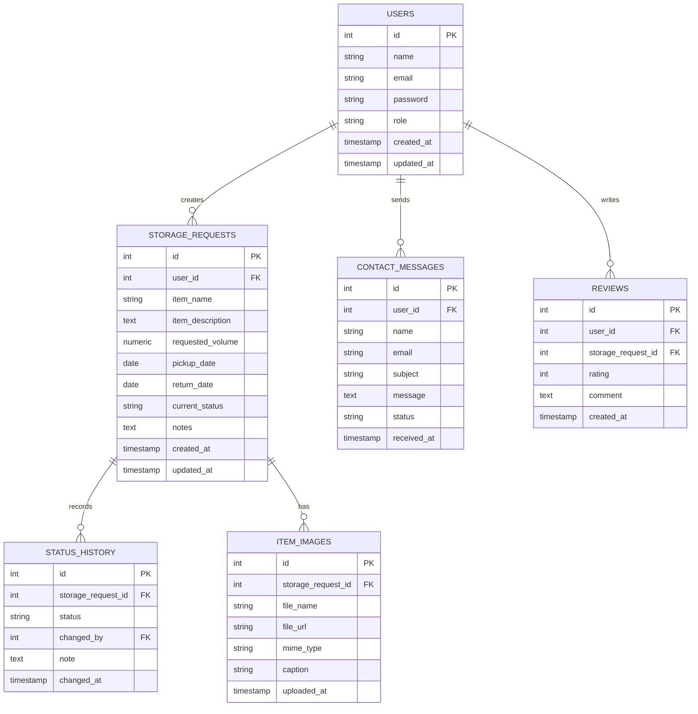

# ERD draft

```mermaid
erDiagram
    USERS ||--o{ STORAGE_REQUESTS : creates
    USERS ||--o{ CONTACT_MESSAGES : sends
    USERS ||--o{ REVIEWS : writes
    STORAGE_REQUESTS ||--o{ STATUS_HISTORY : records
    STORAGE_REQUESTS ||--o{ ITEM_IMAGES : has

    USERS {
      int id PK
      string name
      string email
      string password
      string role
      timestamp created_at
      timestamp updated_at
    }

    STORAGE_REQUESTS {
      int id PK
      int user_id FK
      string item_name
      text item_description
      numeric requested_volume
      date pickup_date
      date return_date
      string current_status
      text notes
      timestamp created_at
      timestamp updated_at
    }

    STATUS_HISTORY {
      int id PK
      int storage_request_id FK
      string status
      int changed_by FK
      text note
      timestamp changed_at
    }

    REVIEWS {
      int id PK
      int user_id FK
      int storage_request_id FK
      int rating
      text comment
      timestamp created_at
    }

    CONTACT_MESSAGES {
      int id PK
      int user_id FK
      string name
      string email
      string subject
      text message
      string status
      timestamp received_at
    }

    ITEM_IMAGES {
      int id PK
      int storage_request_id FK
      string file_name
      string file_url
      string mime_type
      string caption
      timestamp uploaded_at
    }
```
